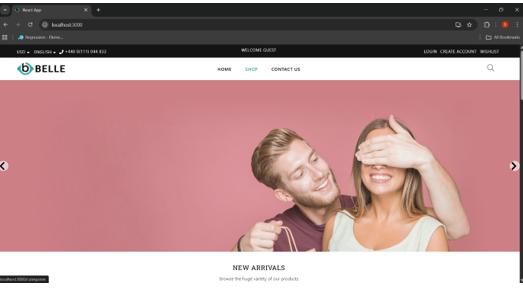
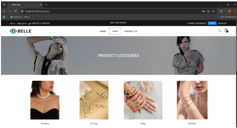
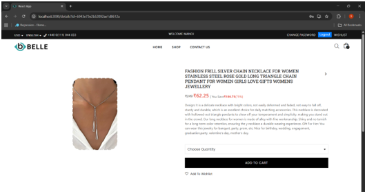
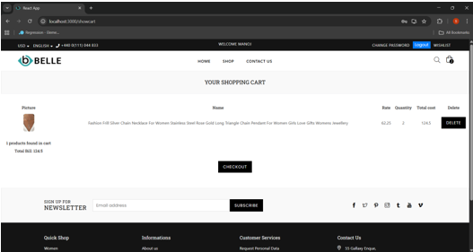

# 🛒 Belle Ecommerce Website

A fully dynamic full-stack Ecommerce Website built with the MERN stack 
during a 6-week industrial training at GTB Computer Education, Jalandhar.

## ✨ Features

- 🛍️ Product display with categories
- 🔐 User authentication (Login / Register)
- 🛒 Shopping cart functionality
- 📦 Order management
- 🔗 RESTful API integration
- 💾 MongoDB database for seamless data management
- 📱 Responsive UI design

## 🛠️ Tech Stack

**Frontend:**


**Backend:**


**Database:**


**Tools:** Git, Postman, VS Code

## 📸 Screenshots




<!-- Add screenshots here -->

## 🚀 How to Run Locally
```bash
# Clone the repo
git clone https://github.com/Simran-775/Ecommerce-Project.git
cd Ecommerce-Project

# Install frontend dependencies
npm install

# Start frontend
npm start

# In a new terminal, start backend
node server.js
```

> Make sure MongoDB is running locally before starting the server.
> Add your environment variables in `.env` file.

## 📚 What I Learned

- Building RESTful APIs with Node.js and Express
- State management and component design in React
- MongoDB database integration and schema design
- API testing with Postman
- Version control with Git and GitHub
- Full-stack application architecture

## 🏆 Context

Built as part of a **6-week Industrial Training** at GTB Computer Education, 
Jalandhar under the mentorship of Mr. Tarunpreet Singh.
Submitted as training project for B.Tech CSE AIML at DAVIET, PTU.

## 📬 Contact
Made with 💙 by [Simranjeet Kaur](https://www.linkedin.com/in/simrandadiala775/)
```

---

Two important things while you add this:

**1. ⚠️ Delete the `.env` file from the repo!** I can see it's publicly visible in your file structure. Go to the repo → click `.env` → click the trash/delete icon. It may contain database credentials. Do this first before anything else!

**2. Add topics** to the repo via the ⚙️ gear in About:
```
mern react nodejs mongodb expressjs ecommerce fullstack javascript
